# Guide to Start the "Fitness Tracker" Web Application  

This guide explains how to start the **fitness-tracker** web project, which consists of both a backend and a frontend. Both must be run in separate terminals.

***(Below there is an explanation of the application)***

## Prerequisites

- **WebStorm** installed on your machine.
- **Node.js** and **npm** installed on your system.
- **Angular CLI** installed globally for the frontend.
- **PostgreSQL** installed on your system.

## Steps to Start the Application

### 1. **Create the Database and Tables in PostgreSQL**

#### **Step 1: Open PostgreSQL Command Line or pgAdmin**

- **Using `psql` (PostgreSQL Command Line Interface):**
  1. Open your terminal or command prompt.
  2. Log into PostgreSQL with the following command:
     ```bash
     psql -U your_username -W
     ```
     Replace `your_username` with your PostgreSQL username. You’ll be prompted for your password.

- **Using pgAdmin:**
  1. Open **pgAdmin** and connect to your PostgreSQL server instance.
  2. Open a new **Query Tool** window.

#### **Step 2: Run the Database Creation Script**
1. Create the **fitness_tracker** database:
   ```sql
   CREATE DATABASE IF NOT EXISTS fitness-tracker;
   ```

#### **Step 3: Switch to the ```fitness-tracker``` Database**
- **Using ```psql```**:
    ```psql
        \c fitness-tracker;
    ```
 - **Using pgAdmin**:
 After creating the database, ensure you're connected to it by selecting the ```fitness-tracker``` database in the pgAdmin window.

 #### **Step 4: Run the Table Creating Script**
 Run the ```create_tables.sql``` script to create the necessary tables for the application.

 #### **Step 5: Insert the Data into the Database**
 Run the ```insert_data.sql``` script to insert example data into the tables.

### 2. **Open the Project in WebStorm**

1. Open **WebStorm**.
2. Open the **fitness-tracker** project in WebStorm.

### 3. **Start the Backend**

1. Open a **terminal** inside WebStorm.
2. Navigate to the backend folder:
   ```bash
   cd fitness-tracker-backend
   ```
3. ```bash
   npm start
   ```

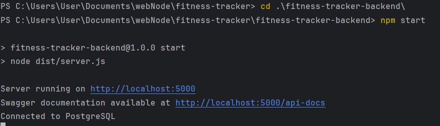

As we can see, the server is running on http://localhost:5000, and Swagger documentation is available at http://localhost:5000/api-docs. Also, we are now connected to the database in PostgreSQL.

### 4. **Start the Frontend**

1. Open another **terminal** inside WebStorm.
2. Navigate to the backend folder:
   ```bash
   cd fitness-tracker-frontend
   ```
3. ```bash
   ng serve
   ```

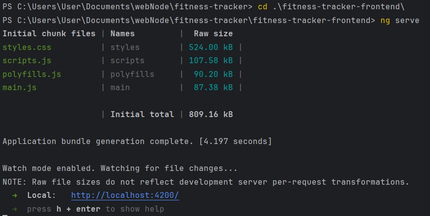

As we can see, we can access our web application in http://localhost:4200.

# Fitness Tracker Web Application

## Overview

Fitness Tracker is a comprehensive web application designed to help users manage their fitness goals, track exercises, and visualize progress using interactive charts and grids. This document serves as a detailed guide for understanding the application's features, structure, and usage.

## Features

### 1. Goals Management
- **Add, Edit, and Delete Goals**: Users can manage their fitness goals, including specifying descriptions and target dates.
- 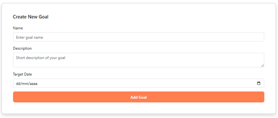
- **Interactive Chart**: Goals are visualized by month using a HighCharts graph for a clear overview of upcoming objectives.
- 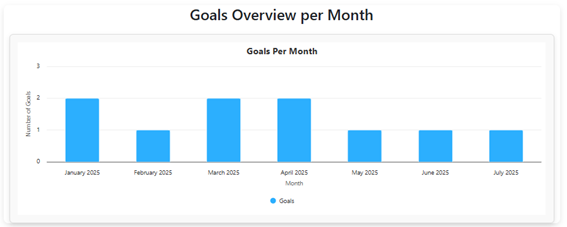   
- **Quick Overview**: An AG Grid table provides an interactive view of all goals, with sorting and filtering capabilities, with the option of exporting the list to CSV.
- 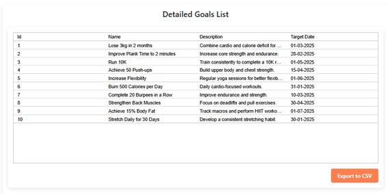   

### 2. Exercises Management
- Users can add exercises with names, descriptions, and categories.
- 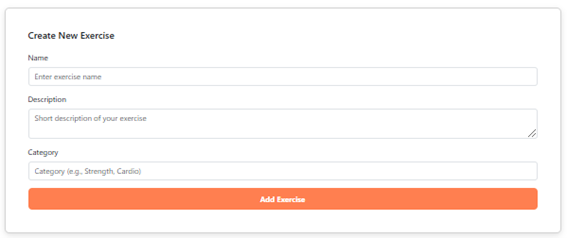   
- Users can also edit and delete exercises they already have.

### 3. Routines Management
- **Create routines** by associating goals and exercises, specifying sets, repetitions, and durations.
- **View, edit, and delete routines** with a user-friendly interface.
- 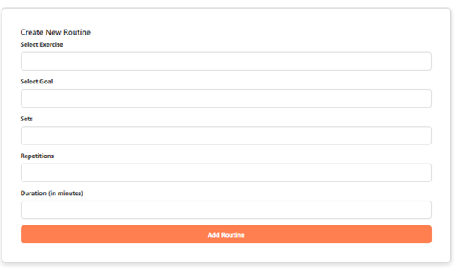   

## User Interface

### Home Page
- **Navbar**: Displays links to “Goals”, “Exercises”, and “Routines” (if logged in).
- 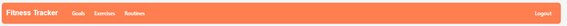
- **Hero Section**: A welcoming banner with a brief description and call-to-action for login.
- 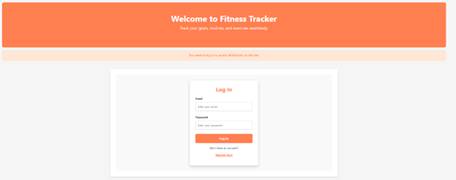   
- **Footer**: Displays course name and year.
- 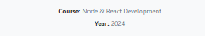

### Goals Page
- **Section Title**: “Goals” is displayed.
- **HighCharts Goals Chart**: Visualizes the number of goals per month.
-    
- **Create Goal Form**: A form to add new goals with fields for name, description, and target date.
- **Goals List**: Interactive cards showing goals details with edit and delete options.
- 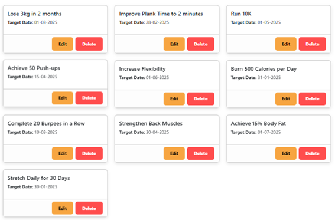
- **AG Grid Table**: A quick overview of goals with filters, sorting, and export functionality.
-    

### Exercises Page
- **Section Title**: “Exercises” is displayed.
- **Create Exercises Form**: Allows users to add new exercises.
- **Exercises List**: Displays all exercises in an organized layout.
- 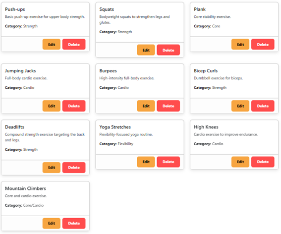   

### Routines Page
- **Section Title**: “Routines” is displayed.
- **Create Routine Form**: A form to add routines by associating goals and exercises.
- **Routines List**: Shows all routines with details such as sets, repetitions, and durations.
- 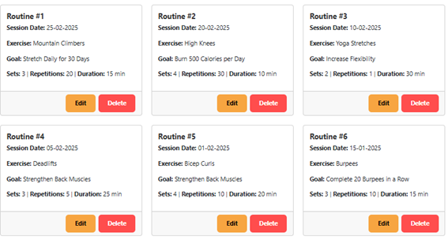   
